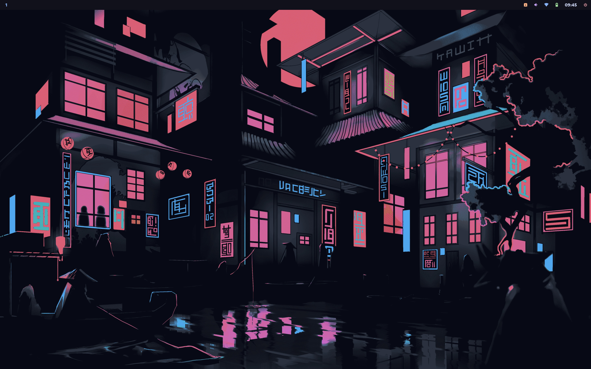

I often get questions on my videos about my desktop and the software I use. Most of the time, this consists of something like **"How do I make my desktop look cool like yours?"** This is a page of everything I use on a daily basis.

My motivation for the software and operating system I use is to be as efficient as possible, and essentially use my computer "at the speed of thought". Using more minimal software helps me to achieve that, but it may not be for everyone.

Some links here are affiliate links to services and products I use.

If you're looking for something that's not listed on this page, feel free to [contact me](/contact) and ask.

## Hardware

- For my laptop, I use a **[ThinkPad T14s (AMD G3)](https://amzn.to/3V3lKhL)**. Yes, modern ThinkPads are still based. The build quality is great, an they're also available at reasonable prices online if you buy used or refurbished. However, they're not as upgradable as they once were, so keep that in mind—I bought mine with 32GB of RAM to future-proof it for a while.
- For my mouse, I use a **[Logitech M720 Triathalon](https://amzn.to/48PmLgl)**. It's a great, comfortable mouse. Not too much to say about it, but it's my favorite mouse I've ever used.
- For my keyboard, I use a **Logitech K810** (but it's ancient, so buy [the new version](https://amzn.to/3V7gMQP)). It's a Bluetooth keyboard that does the job. I need an external keyboard for use with my laptop stand so I don't look like the Hunchback of Notre Dame after working on it all day.
- For my laptop stand, I use a **[Roost Laptop Stand](https://amzn.to/4c25zqV)**. This is essential if you want to avoid [the typical back and neck pain associated with being hunched over a laptop all day](https://www.youtube.com/watch?v=Rc8ZQeIZn40). It also folds small enough to stuff it into a backpack to work outside, which I often do.

## Software

- For my operating system, I use **[Arch Linux](https://archlinux.org)** (btw). It's the only Linux distribution that gets out of my way and just lets me do my work. It's very minimal and easy-to-use *after* you get over the initial learning curve, but it's definitely worth the investment.
- **[Hyprland](https://hyprland.org/)** is my window manager, or basically "how I make my desktop look cool". For my workflow, a tiling window manager is essential once you get over the learning curve. Hyprland uses Wayland and also has some nice animations. Previously, I've used [bspwm](https://github.com/baskerville/bspwm) in some older videos.
- **[Waybar](https://github.com/Alexays/Waybar)** is the status bar at the top.
- I currently use **[kitty](https://sw.kovidgoyal.net/kitty/)** for my terminal due to its support for images in Wayland. It's very customizable but still very fast. For my shell, I use **[zsh](https://www.youtube.com/watch?v=dRdGq8khTJc)** with [a few plugins](https://www.youtube.com/watch?v=wHnMd8uz6j0) for niceties like syntax highlighting and auto-complete.
- For my web browser, I use **[Firefox](https://www.youtube.com/watch?v=w0SJFED5xK0)**. I've tried every other browser and Firefox, despite its flaws, remains the best. However, I use a custom user.js file (based on [Betterfox](https://github.com/yokoffing/BetterFox)) to disable trackers and remove annoying features. I also use a [custom theme](https://github.com/ericmurphyxyz/userchrome.css) to make it look a bit nicer. [Brave](https://www.youtube.com/watch?v=uB845Elrds0) is also very good and I still use it occasionally for websites that don't work in Firefox.
    - For browser extensions, I use [uBlock Origin](https://ublockorigin.com/) to block ads and trackers, [Vimium](https://addons.mozilla.org/en-US/firefox/addon/vimium-ff/) for vim-like keybindings, and [Bitwarden](https://bitwarden.com/) for password management. Everything else is superfluous.

## Services

- For email, I use **[ProtonMail](https://pr.tn/ref/Y8M5X5MSTJ9G)**. Despite the haters, it's still the best privacy-respecting email service out there for most people (even though [email is inherently not private](https://www.youtube.com/watch?v=ljFAODAfAC8)). I pay for custom domain email, and it's the best email experience I've had to date. If you use the webmail, you get all the modern niceties of something like Gmail without the creepy tracking.
- **[Bitwarden](https://bitwarden.com/)** is the best password manager. It does everything you could need a password manager to do, and the premium subscription if you want a few more features is dirt-cheap.
- This site is hosted by **[Vultr](https://www.vultr.com/?ref=9005580-8H)**. I use a cheap Debian VPS to host all my projects. Having your own VPS gives you a lot more freedom in hosting your own website.
- I use **[NameCheap](https://namecheap.pxf.io/21z0BQ)** to purchase my domains. Great prices and customer support make this one a no-brainer for me. I've been using them for years with no complaints. Whatever you do, do *not* use GoDaddy.

## Applications

- I use **[neovim](https://www.youtube.com/watch?v=qQvFC0wRiRE)** for all of my writing. vim notoriously has a steep learning curve, but as with most things, I think the payoff is worth it.
- **[VSCodium](https://www.youtube.com/watch?v=c_eFYsuV1PU)** is my preferred code editor for when I’m working on larger projects. VSCodium is VS Code, just without the Microsoft telemetry.
- I use the terminal file manager **[lf](https://www.youtube.com/watch?v=2oWqD3JCXuI)**. It's very fast and customizable and supports image previews with a custom script.
- For note-taking, I use **[Obsidian](https://obsidian.md/)**. I haven't been using this for very long, and I'm still not sure I'm entirely satisfied with it, but it's very good at what it does.
- For email, I use **[Thunderbird](https://www.thunderbird.net/)**. I have my annoyances with it, but it's the best email client there is on Linux.
- For an application launcher, I use **[Tofi](https://github.com/philj56/tofi)**. I previously used Rofi, but I had some issues with it on Wayland previously and liked the simplicity of Tofi more. It's simple and customizable and can also be used as a menu (I use it as a power menu).

## Theme

- I use the **[Catppuccin](https://github.com/catppuccin/catppuccin)** color scheme for just about everything.
- For my terminal font, I use **[Maple Mono](https://github.com/subframe7536/Maple-font)**. Of course, I also use [Nerd Font](https://www.youtube.com/watch?v=b_FSqS4C1Ns) icons.

## This Website

- This site is built with **[Hugo](https://www.youtube.com/watch?v=KwkjqMs7ZYI)**, a static site generator that just outputs HTML and CSS instead of the bloated mess that is most of the modern web.
